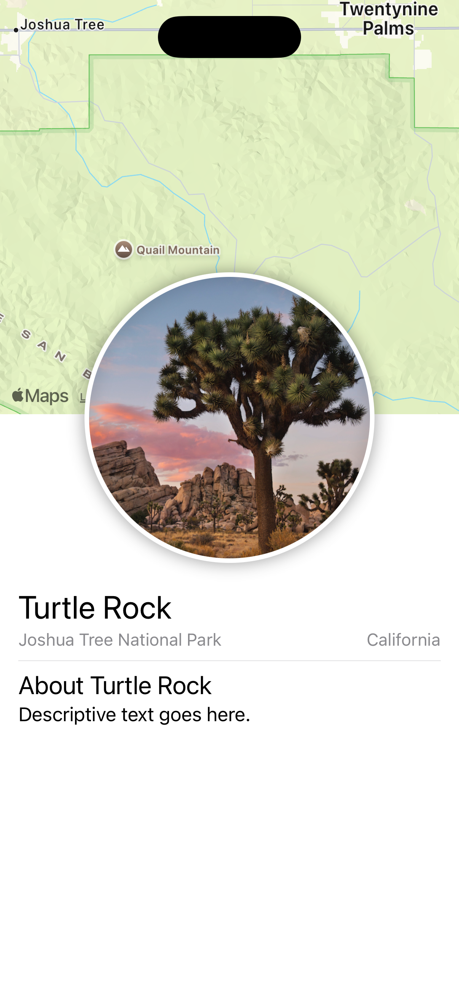
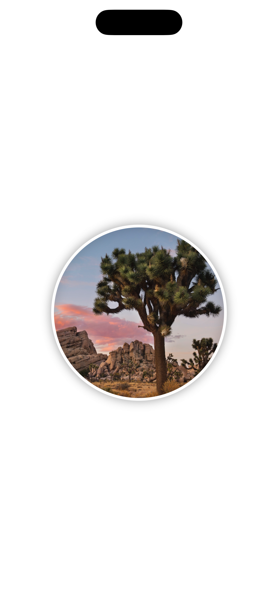
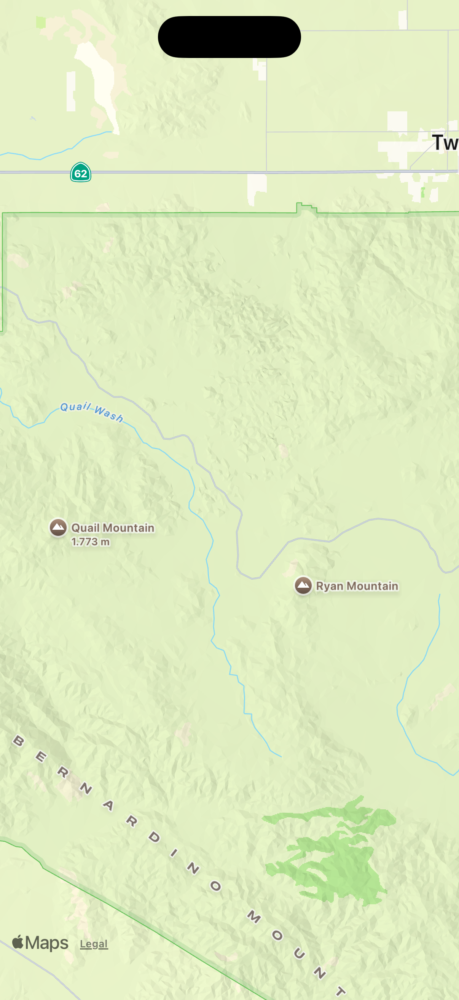
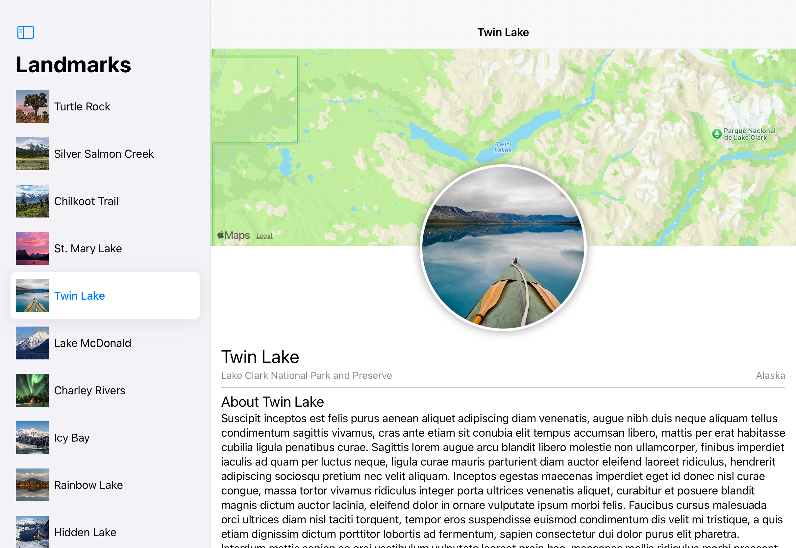
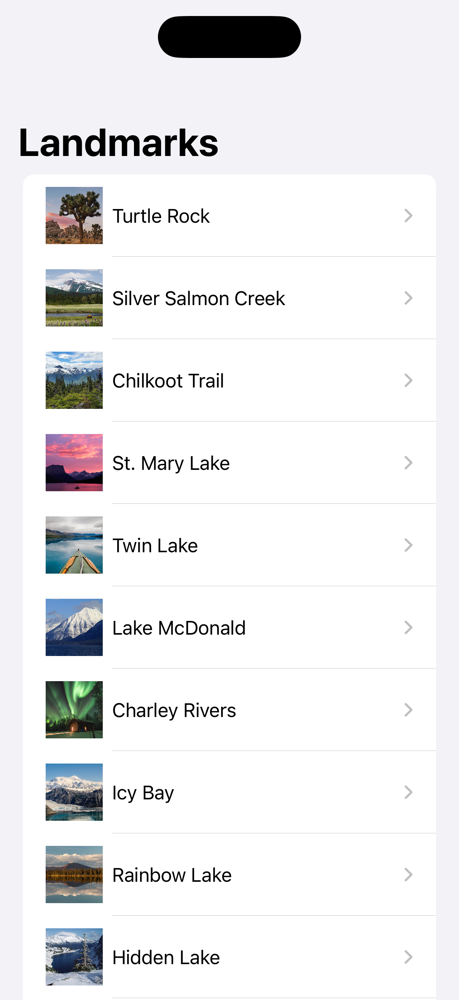

# 🌍 SwiftUI Essentials – Landmarks App

A simple iOS app demonstrating SwiftUI basics, navigation, and state-driven interactivity using Apple’s tutorials:

---

## 🏗️ Project Structure

- **Part 1: 🧩 SwiftUI Essentials – Creating and Combining Views**
  - 🗺️ Built the `LandmarkDetail` view with:
    - 🗺️ `MapView`
    - 🖼️ `CircleImage`
    - 📐 Stacks (`VStack`, `HStack`) for layout
    - ⚡ Live previews in Xcode
   

- **Part 2: 📋 Building Lists and Navigation**
  - ➕ Created `LandmarkRow` to display a landmark’s image & name in a row
  - 📜 Built `LandmarkList` using `List` to dynamically display all landmarks
  - 🆔 Made `Landmark` conform to `Identifiable` for use in `List`
  - 🔗 Used `NavigationView` + `NavigationLink` to enable navigation from the list to detail views
  - ✅ Now users can browse a list of landmarks and tap to see details
 

- **Part 3: 🎛️ Handling User Input**
  - 📌 Introduced **state management** with the `@State` property wrapper  
  - ⭐ Added a **Favorite Button** (toggle with a star icon) to mark landmarks as favorites
  - 🖱️ Connected button state to the landmark model, so UI updates automatically when toggled
  - 📲 Updated `LandmarkList` to visually show favorite landmarks with a filled star
  - 🎯 Reinforced SwiftUI’s declarative pattern: views react to changes in state automatically

---

## ✨ Features
- 📍 **Detail View**: Shows map, circular image, and landmark info with declarative SwiftUI.  
- 📋 **Dynamic List View**: Automatically generates rows from data.  
- 🧭 **Navigation Flow**: Seamless transitions from list ➝ detail using SwiftUI navigation components.  
- ⭐ **Favorites**: Mark and filter landmarks interactively with state-driven UI updates.  

---

## 🚀 Getting Started
1. ⬇️ Clone the project.  
2. 💻 Open in Xcode 15+.  
3. 📱 Run on a simulator (e.g. iPhone 15).  
4. 🔍 Explore how the list integrates with the detail views.  
5. 🎨 Try toggling favorites and see the state update instantly.  

---

## 🔮 Further Enhancements
Consider exploring:  
- 🧭 Advanced navigation patterns (`NavigationSplitView`, `NavigationStack`)  
- 🗂️ Tab-based or multi-column layouts  
- ⭐ Add a **"Favorites only" toggle** to filter the list  
- 📊 Integrating Apple’s SwiftData or additional tutorial paths  

📚 [SwiftUI Official Tutorials](https://developer.apple.com/tutorials/swiftui)
